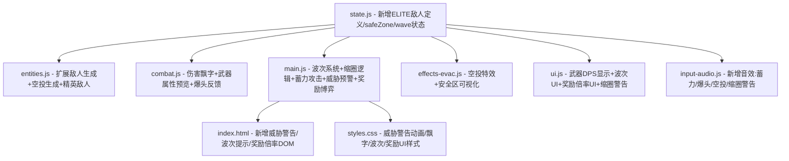

## 用户需求

对"星渊派对：星际劫掠"FPS游戏进行全面的可玩性优化，围绕三大核心问题展开。

## 产品概述

当前游戏是一个基于Three.js的第一人称射击搜打撤游戏，存在敌人强度过高且缺少威胁预警、武器伤害反馈不直观、以及整体游戏循环缺乏深度和节奏感等问题，需要从数值平衡、战斗反馈、游戏机制三个维度进行系统性优化。

## 核心功能

### 一、敌人平衡与威胁预警体系

- 降低敌人基础伤害（机械哨兵 12->8，外星小怪 8->5），拉长攻击间隔
- 增加屏幕边缘威胁预警指示（敌人进入感知范围时屏幕边缘出现方向性红色脉冲警告条）
- 小地图敌人标记增大增亮，追击状态敌人闪烁标记
- 敌人攻击前增加明显的蓄力阶段（0.5-0.8秒预警动画+音效），给玩家反应时间

### 二、武器伤害可视化系统

- 伤害飘字系统：命中敌人时在命中点上方弹出伤害数字，爆头显示金色大字+特殊音效
- 武器信息面板优化：HUD武器栏显示当前武器DPS和单发伤害
- 拾取武器时弹出属性预览（伤害/射速/弹药容量），与当前武器对比
- 击杀时显示总输出伤害统计

### 三、搜打撤玩法深度优化

- 波次威胁系统：对抗阶段每45秒触发一波敌人增援（数量递增），同时刷新地图物资
- 高价值空投事件：对抗阶段随机空投（含稀有武器/大量金币/多个道具），空投有光柱标记+地图标记
- 危险区域动态缩圈：撤离阶段开始后外围区域逐渐变为伤害区（类似毒圈），驱动玩家向中心移动
- 撤离博弈机制：撤离点开启后显示"额外停留奖励"倒计时，每多坚持15秒额外奖励翻倍，但敌人越来越强
- 精英敌人/BOSS：对抗阶段中期生成一个精英敌人（高血量+特殊攻击+大量掉落）

## 技术栈

- 前端框架：原生HTML/CSS/JavaScript + Three.js r128（保持现有技术栈）
- 音频：Web Audio API（已有audioCtx合成音效系统）
- 渲染：Three.js WebGLRenderer + 2D HUD叠加层

## 实现方案

### 总体策略

在现有代码架构基础上，通过修改数值配置、扩展敌人AI状态机、新增HUD叠加组件、增加游戏事件系统来实现全部优化。所有修改遵循当前项目的全局变量+函数式的代码组织模式，不引入新的架构模式。

### 关键技术决策

**1. 敌人平衡与预警**

- 在 `js/state.js` 中直接调整 WEAPONS 和敌人在 `js/entities.js` 中的数值参数
- 敌人攻击增加 `chargeTime` 蓄力阶段：在 `updateEnemies` 中新增 `charging` 状态，蓄力期间敌人停止移动并播放蓄力动画（mesh发光+缩放脉冲），蓄力完成后才造成伤害，给玩家0.6秒反应窗口
- 屏幕威胁预警：新增CSS动画的边缘警告条，当敌人进入追击状态且距离<20时，在屏幕对应方向显示半透明红色脉冲条，复用现有 `showDamageDirection` 的角度计算逻辑但改为持续显示
- 小地图优化：在 `updateMinimap` 中增大敌人标记尺寸（4px->6px），chase状态敌人用闪烁效果渲染

**2. 伤害飘字系统**

- 采用3D世界空间飘字方案：在命中点创建 `THREE.Sprite` + `CanvasTexture` 显示伤害数字，随时间上浮并淡出，通过 `particles` 数组管理生命周期
- 爆头判定增加特殊反馈：金色大号文字 + 专用爆头音效 + "HEADSHOT" 标记
- 选择3D飘字而非DOM飘字的原因：与现有粒子系统统一管理，性能更好，且自动随视角透视变化

**3. 搜打撤核心机制**

- 波次系统：在 `updatePhase` 中扩展，combat阶段每45秒调用新函数 `triggerWave(waveNum)` 生成增援敌人，增援敌人从地图边缘随机位置生成，数量 = 2 + waveNum，物资同步刷新
- 空投系统：新函数 `spawnAirdrop()`，在combat阶段随机触发（约每60秒），创建带光柱+声效的空投箱3D对象，包含高价值物品，小地图用金色菱形标记
- 安全区缩圈：新增 `safeZone` 全局状态（中心点+当前半径），撤离阶段开始后半径以每秒约0.8的速度收缩，玩家在安全区外每秒受3点伤害，通过地面环形指示器可视化安全区边界
- 奖励博弈：撤离点开启后新增 `bonusTimer` 倒计时，每15秒 `bonusMultiplier` 递增0.5x，同时每15秒额外生成一波敌人增援，UI显示当前额外奖励倍率
- 精英敌人：在 `spawnEnemies` 中新增 `elite` 类型（200HP，伤害15，速度4，攻击间隔2s），combat中期生成，体型更大+特殊颜色+头顶BOSS标记

## 实现注意事项

**性能控制**

- 伤害飘字Sprite限制同时存在数量（最多20个），超出时移除最早的
- 波次增援敌人总数上限控制在20个以内，防止渲染帧率下降
- 安全区缩圈视觉效果用单个 `RingGeometry` 实现，不创建大量粒子
- 威胁预警DOM元素复用而非反复创建销毁

**向后兼容**

- 所有新增状态字段在 `resetGame` 中正确初始化
- 新增的3D对象在 `resetGame` 和 `endGame` 中正确清理
- 保持现有教程内容不受影响，新机制通过游戏内提示引导

**数值平衡参考**

- 玩家有效生存时间目标：从当前10-12秒提升到20-25秒
- 搜刮阶段应有轻度威胁（少量巡逻敌人），对抗阶段为核心挑战，撤离阶段为高压冲刺

## 架构设计



## 目录结构

```
project-root/
├── index.html           # [MODIFY] 新增威胁警告容器、波次提示UI、奖励倍率UI、武器属性预览弹窗
├── styles.css           # [MODIFY] 新增威胁预警脉冲动画、伤害飘字样式、波次/空投/缩圈/奖励倍率UI样式
├── js/
│   ├── state.js         # [MODIFY] 调整敌人数值、新增精英敌人定义、新增safeZone/wave/bonus全局状态、新增稀有武器定义
│   ├── entities.js      # [MODIFY] 新增精英敌人生成函数、空投生成函数、波次增援生成函数、物资刷新函数
│   ├── combat.js        # [MODIFY] 新增伤害飘字系统、爆头特殊反馈、武器拾取属性预览、击杀统计
│   ├── main.js          # [MODIFY] 敌人AI新增蓄力状态、波次系统调度、安全区缩圈逻辑、威胁预警系统、奖励博弈计时、resetGame/endGame清理
│   ├── effects-evac.js  # [MODIFY] 新增空投光柱特效、安全区边界可视化环、伤害飘字3D Sprite创建
│   ├── ui.js            # [MODIFY] 武器信息显示DPS、波次/空投提示、小地图增强（空投标记/安全区圈/敌人闪烁）、奖励倍率显示
│   ├── input-audio.js   # [MODIFY] 新增蓄力音效、爆头音效、空投降落音效、缩圈警告音效、波次警报音效
│   └── scene.js         # [不修改] 保持现有场景结构
```

## 关键代码结构

```typescript
// js/state.js 中新增的全局状态扩展（伪代码）
interface SafeZone {
  center: {x: number, z: number};  // 安全区中心
  radius: number;                   // 当前半径（初始=mapSize）
  shrinking: boolean;               // 是否正在收缩
  damagePerSec: number;             // 区外每秒伤害
}

interface WaveState {
  current: number;      // 当前波次（0=未开始）
  timer: number;        // 距下一波倒计时
  interval: number;     // 波次间隔（45秒）
  maxEnemies: number;   // 场上敌人上限
}

interface BonusState {
  active: boolean;          // 是否激活
  timer: number;            // 当前周期倒计时
  multiplier: number;       // 当前奖励倍率
  cycleInterval: number;    // 每15秒一个周期
}
```